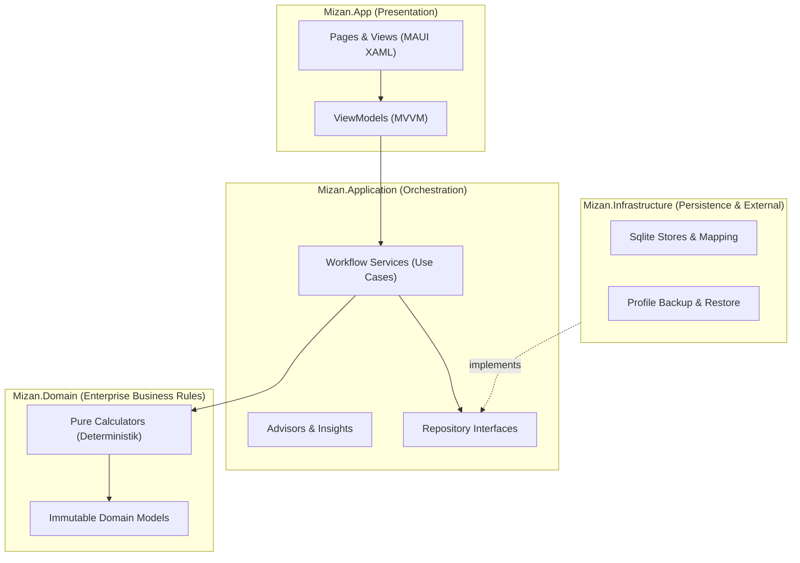

# 🗺️ Mizan Mimarisi ve Sınıf Haritası

> **Mizan**, bireylerin ve düzensiz nakit akışına sahip işletmelerin finansal dengesini koruyan, makro düzeyde **12 Aylık Finansal Projeksiyon & Senaryo Karar Motoru**dur.

Bu harita, kod tabanındaki katmanları, 5 temel taşıyıcı sütunu ve sınıflar arası bağımlılık ilişkilerini bir bakışta görmenizi sağlar.

---

## 🏛️ Mimari Katmanlar (Clean Architecture)



---

## 🌟 5 Temel Taşıyıcı Sütun ve Kilit Aktörler

### 1. Dönem Döngüsü ve Mutabakat (Plan vs. Gerçek)
Mikro harcama fişi girmeden, dondurulmuş plan ile dönem sonundaki gerçekleşmelerin tek kalemde mutabakatını sağlar.
- 📐 **Domain:** [[CashFlowPeriodCalculator]], [[CashFlowAllocationPlanner]]
- ⚙️ **Application:** [[PeriodWorkflowService]], [[PeriodReviewService]]
- 📱 **UI / ViewModel:** [[PeriodReviewWizardViewModel]]
- 📜 **İş Kuralı:** [[BR-RECON-01 - Donem Mutabakati ve Gozlem Noktasi|BR-RECON-01: Dönem Mutabakatı ve Gözlem Noktası]]

### 2. İleriye Dönük 12 Aylık Projeksiyon
Anchor snapshot noktasından başlayarak tam 365 gün boyunca kümülatif likiditeyi ve finansman açıklarını gün gün simüle eder.
- 📐 **Domain:** [[FinancialProjectionCalculator]], [[IncomeProjectionCalculator]], `CalendarRules`
- ⚙️ **Application:** [[FinancialProjectionService]], `FinancialPlanQueryService`
- 📱 **UI / ViewModel:** [[DashboardViewModel]], [[FutureMonthsViewModel]]
- 📜 **İş Kuralı:** [[BR-PROJ-01 - 12 Aylik Kumulatif Likidite ve Finansman Acigi|BR-PROJ-01: 12 Aylık Kümülatif Likidite ve Finansman Açığı]]

### 3. Akıllı Senaryo Simülatörü (What-If Motoru)
Canlı bütçeyi bozmadan geçici planlar oluşturur; koşulları bağımsız açıp kapatarak test etmeyi ve tek tıkla canlıya aktarmayı sağlar.
- 📐 **Domain:** [[SimulationCalculator]], [[LoanAmortizationCalculator]]
- ⚙️ **Application:** [[SimulationWorkflowService]], `SimulatorInsightService`, [[LoanPayoffAdvisor]]
- 📱 **UI / ViewModel:** [[SimulationViewModel]]
- 📜 **İş Kuralı:** [[BR-SIM-01 - Senaryo Kosul Izolasyonu ve Canliya Aktarim|BR-SIM-01: Senaryo Koşul İzolasyonu ve Canlıya Aktarım]]

### 4. Gerçekçi Bankacılık Faiz & Kart Modellemesi
Kredi kartı ekstre carry faizleri ve açık faizlerini gerçek bankacılık yuvarlama ve kurallarıyla hesaplayarak açık maliyetini öngörür.
- 📐 **Domain:** [[CreditCardStatementCalculator]], `CreditCardActualPaymentReconciler`
- ⚙️ **Application:** [[CreditCardObligationService]], `LoanPayoffService`
- 📱 **UI / ViewModel:** [[CardControlViewModel]]
- 📜 **İş Kuralı:** [[BR-CARD-01 - Kredi Karti Carry Faizi ve Asgari Tutar Mantigi|BR-CARD-01: Kredi Kartı Carry Faizi ve Asgari Tutar Mantığı]]

### 5. Operasyonel Takip ve Hatırlatıcı
Bildirim pencereleri (rahat / agresif) ve "Ödedim / Ertele" aksiyonlarıyla dönem içi taahhütlerin kaçırılmasını engeller.
- 📐 **Domain:** [[MandatoryPaymentCalculator]], [[PaymentAllocationStrategyResolver]]
- ⚙️ **Application:** [[PaymentReminderPlanner]], `ObligationManagementService`
- 📱 **UI / ViewModel:** `PaymentReminderCardViewModel`
- 📜 **İş Kuralı:** [[BR-REMIND-01 - Operasyonel Hatirlatici ve Vade Erteleme|BR-REMIND-01: Operasyonel Hatırlatıcı ve Vade Erteleme]]

---

## 📊 Dataview: Tüm Mimari Sınıflar (Class Index)

*(Obsidian Dataview eklentisi aktif olduğunda otomatik dinamik tablo üretir)*

```dataview
TABLE layer AS "Katman", type AS "Tür", file.outlinks AS "Bağımlılıklar", file.inlinks AS "Kullananlar"
FROM #class OR #use-case
SORT layer ASC, file.name ASC
```

---

## 🔗 İlgili Bağlantılar
- [[Is Kurallari Indeksi|İş Kuralları İndeksi]]
- [[ADR-001 - Makro Denge vs Mikro Fis Takibi|ADR-001: Makro Denge vs Mikro Fiş Takibi]]
- [[ADR-002 - Deterministik Offline-First Projeksiyon Motoru|ADR-002: Deterministik Offline-First Projeksiyon Motoru]]
