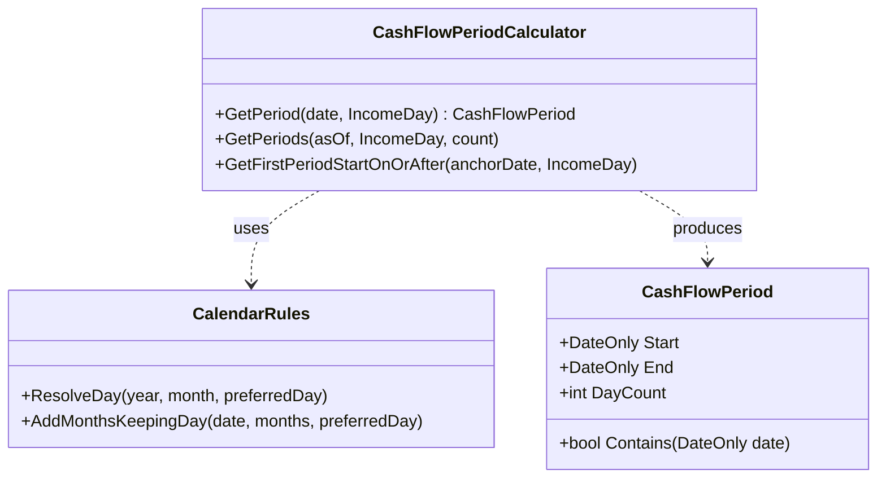

---
title: CashFlowPeriodCalculator
type: class
layer: Domain
namespace: Mizan.Domain.Calculations
tags:
  - class
  - domain
  - calculation
  - period
---

# `CashFlowPeriodCalculator`

Dönem döngülerinin başlangıç ve bitiş sınırlarını, kullanıcının gelir gününe (`IncomeDay`) ve ay sonu gün sayısı dinamiklerine (`CalendarRules`) göre deterministik olarak hesaplayan çekirdek sınıf.

---

## 🧭 Mimari Konum & Sorumluluk
- **Katman:** `Domain`
- **Türü:** Saf Matematiksel Hesaplayıcı (Pure Calculator / Stateless)
- **Sorumluluğu:** 
  - Belirli bir tarihin hangi nakit akışı dönemine (`CashFlowPeriod`) ait olduğunu bulmak.
  - İleriye dönük $N$ adet dönemin `[Start, End)` aralıklarını üretmek.
  - Anchor tarihinden sonraki ilk geçerli dönem başlangıcını saptamak.

---

## 🔗 Bağımlılıklar (Depends On)
- `CalendarRules` — Ayın kaç çektiğini (28, 29, 30, 31) ve ay atlamalarında gün koruma kurallarını işletir.
- `CashFlowPeriod` — `[Start, End)` yarı-açık aralığını temsil eden immutable record.

## 👥 Kimler Tarafından Kullanılıyor? (Referenced By)
- [[FinancialProjectionCalculator]] — 12 aylık projeksiyon aralıklarını oluşturmak için.
- [[PeriodWorkflowService]] — Aktif dönemi ve dönem mutabakat tarihlerini doğrulamak için.
- `PeriodReviewService` — Dönem kapanış kontrolü için.

---

## 📜 Bağlı İş Kuralları
- [[BR-RECON-01 - Donem Mutabakati ve Gozlem Noktasi|BR-RECON-01: Dönem Mutabakatı ve Gözlem Noktası]]

---

## 💡 Kritik Metotlar

```csharp
// Belirli bir tarihin içine düştüğü dönemi verir
public CashFlowPeriod GetPeriod(DateOnly date, int IncomeDay);

// İleriye dönük N adet dönemi liste olarak döndürür
public IReadOnlyList<CashFlowPeriod> GetPeriods(DateOnly asOf, int IncomeDay, int count);

// Anchor tarihinden sonraki ilk dönem başlangıcını bulur
public DateOnly GetFirstPeriodStartOnOrAfter(DateOnly anchorDate, int IncomeDay);
```

---

## 🔬 Diyagram


