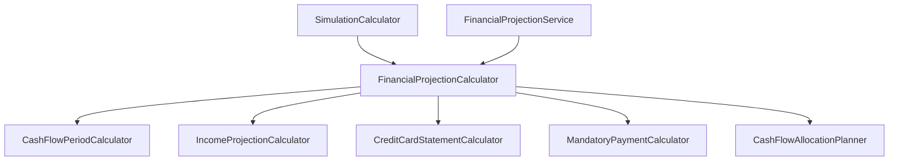

# `FinancialProjectionCalculator`

Mizan'ın kalbi olan, dondurulmuş plan veya dinamik finansal durumdan yola çıkarak ileriye dönük (varsayılan 12 aylık / 365 günlük) deterministik nakit projeksiyonunu üreten orkestratör hesaplayıcı.

---

## 🧭 Mimari Konum & Sorumluluk
- **Katman:** `Domain`
- **Türü:** Saf Hesaplayıcı (Stateless Calculator)
- **Sorumluluğu:** 
  - Kredi kartı ekstre projeksiyonları, krediler, planlı ödemeler ve büyük harcamaları toplayıp tek bir yükümlülük havuzuna dönüştürmek.
  - Dönem dönem gelir ve giderleri eşleştirerek her bir dönemin açılış bakiyesi, toplam geliri, zorunlu gideri, serbest yaşam bütçesi ve kapanış likiditesini hesaplamak.
  - Finansman açığı (eksi bakiye) oluşan dönemleri saptamak.

---

## 🔗 Bağımlılıklar (Depends On)
- [[CashFlowPeriodCalculator]] — Projeksiyon dönem sınırlarını (`CashFlowPeriod`) üretir.
- [[IncomeProjectionCalculator]] — Düzenli ve düzensiz gelir akışlarını dönemlere yayar.
- [[CreditCardStatementCalculator]] — Kredi kartı ekstrelerini ve carry faizlerini projekte eder.
- [[MandatoryPaymentCalculator]] — Kredi, taksit ve planlı ödemeleri birleştirir.
- [[CashFlowAllocationPlanner]] — Ödemeleri dönemlere dağıtır.
- [[PaymentAllocationStrategyResolver]] — Tahsis stratejisi kurallarını doğrular.

## 👥 Kimler Tarafından Kullanılıyor? (Referenced By)
- [[FinancialProjectionService]] — Application katmanında veritabanı ve snapshot'ları bağlayarak projeksiyonu sunar.
- [[SimulationCalculator]] — What-If senaryolarında baseline ve senaryo planlarını karşılaştırmak için çalıştırır.

---

## 📜 Bağlı İş Kuralları
- [[BR-PROJ-01 - 12 Aylik Kumulatif Likidite ve Finansman Acigi|BR-PROJ-01: 12 Aylık Kümülatif Likidite ve Finansman Açığı]]
- [[BR-CARD-01 - Kredi Karti Carry Faizi ve Asgari Tutar Mantigi|BR-CARD-01: Kredi Kartı Carry Faizi ve Asgari Tutar Mantığı]]

---

## 📊 Bağımlılık Akış Şeması

