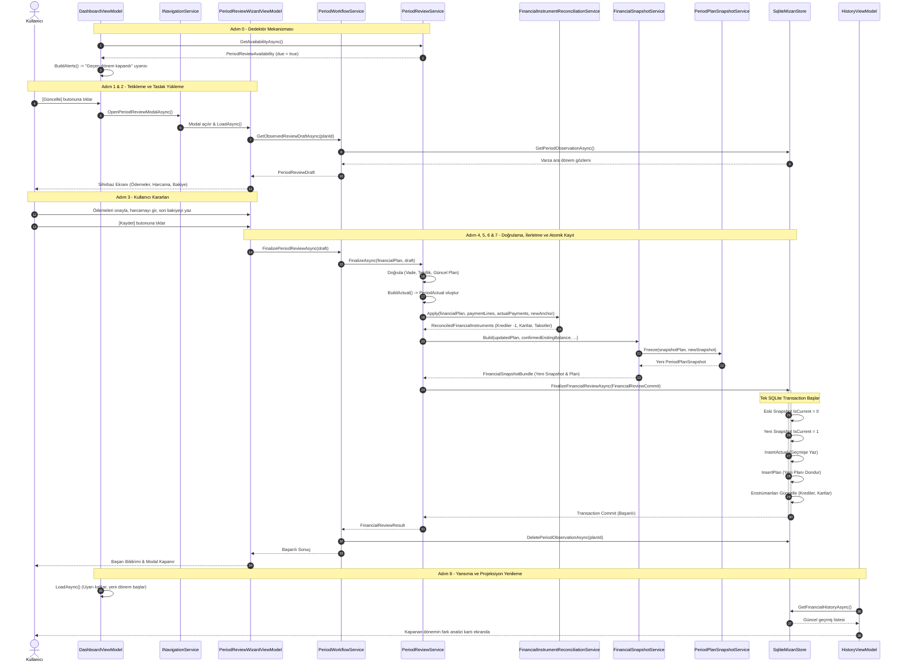

# FLOW-01: Dönem Kapatma ve Geçmiş Kayıt Akışı

Bu doküman, Mizan mimarisinde bir finansal dönemin sona ermesinden yeni dönemin açılışına kadar gerçekleşen **Dönem Kapatma, Fiili Gerçekleşme (Actuals) Tespiti ve Geçmiş Kayıt (History)** operasyonunun uçtan uca icra hattını (execution pipeline) detaylandırır.

---

## 🎯 Akışın Amacı ve Çıkış Noktası (Genesis)

Mizan, kullanıcıyı günlük mikro harcama fişleri girmeye zorlayan geleneksel bütçe uygulamalarından farklı olarak **Makro Denge & Mutabakat** prensibiyle ([[ADR-001 - Makro Denge vs Mikro Fis Takibi]]) çalışır.

Dönem başladığında harcamalar ve ödemeler dondurulur ([[BR-RECON-01 - Donem Mutabakati ve Gozlem Noktasi]]). Ay bittiğinde sistem sessizce beklemek yerine proaktif bir dedektör ile devreye girer:
- **Dedektör Mekanizması:** [[PeriodReviewService]].`GetAvailabilityAsync` metodu sistem saati ([[IClock]]) ile dondurulmuş planın uzlaşma vadesini (`plan.SettlementAvailableFrom`) kıyaslar.
- **Tetikleyici Durum:** Eğer `clock.Today >= plan.SettlementAvailableFrom` koşulu sağlanmış ve bu dönem henüz kapatılmamışsa (`finalized == false`), sistem dönemin kapatılmaya hazır olduğunu ilan eder.
- **Kullanıcı Karşılama:** [[DashboardViewModel]] ana ekranda yüksek öncelikli bir eylem uyarısı (`DashboardAlertLevel.Action`) üreterek kullanıcıya *"Geçen dönem kapandı"* uyarısını ve **[Güncelle]** eylem butonunu sunar.

---

## 🪜 Adım Adım Uçtan Uca İcra Hattı (Execution Pipeline)

```
[Adım 0: Dedektör & Alarm]
       │  clock.Today >= plan.SettlementAvailableFrom
       ▼
[Adım 1: Tetikleme & Modal]
       │  DashboardViewModel -> INavigationService.OpenPeriodReviewModalAsync
       ▼
[Adım 2: Taslağın Çözülmesi (Draft)]
       │  PeriodWorkflowService.GetObservedReviewDraftAsync (Varsa Checkpoint Verisi)
       ▼
[Adım 3: Sihirbaz & Kullanıcı Kararları (Wizard)]
       │  PeriodReviewWizardViewModel (Ödemeler, Fiili Yaşam Harcaması, Bakiye)
       ▼
[Adım 4: Doğrulama & Invariant Kontrolü]
       │  PeriodReviewService.FinalizeAsync -> BuildActual (Dondurulmuş Plan Dokunulmazlığı)
       ▼
[Adım 5: Finansal Enstrümanları İlerletme]
       │  FinancialInstrumentReconciliationService.Apply (Kredi, Kart, Taksit Güncelleme)
       ▼
[Adım 6: Denge Korunumu & Yeni Dönem İnşası]
       │  FinancialSnapshotService.Build -> PeriodPlanSnapshotService.Freeze
       ▼
[Adım 7: Atomik Veritabanı Kaydı (ACID Transaction)]
       │  SqliteMizanStore.FinalizeFinancialReviewAsync & DeletePeriodObservationAsync
       ▼
[Adım 8: Yansıma ve Bitiş]
          Dashboard Alert Temizlenir, HistoryViewModel Güncellenir, 12 Ay Yeniden Hesaplanır
```

---

### Adım 0: Dedektör & Bildirim (Detection & Alerting)
1. [[DashboardViewModel]].`LoadAsync` veya `RefreshAsync` çalıştığında [[PeriodWorkflowService]] üzerinden [[PeriodReviewService]].`GetAvailabilityAsync` çağrılır.
2. Servis veritabanındaki aktif snapshot'ı (`current`) ve bu snapshot'a bağlı dondurulmuş planı (`plan`) inceler:
   $$Due = (plan \neq null) \land (\neg finalized) \land (Today \ge plan.SettlementAvailableFrom)$$
3. Durum `due == true` ise [[DashboardViewModel]].`BuildAlerts` metodu devreye girer:
   - Başlık: *"Geçen dönem kapandı"*
   - Mesaj: *"Ödemelerin ve dönem harcaman netleştiyse gerçekte ne olduğunu kaydet; planını güncel durumundan yeniden kurayım."*
   - Eylem Butonu: *"Güncelle"* (`OpenPeriodReviewCommand`).

### Adım 1: Kullanıcı Tetiklemesi & Modal Açılışı
1. Kullanıcı uyarıdaki **[Güncelle]** butonuna tıklar.
2. [[DashboardViewModel]].`OpenPeriodReviewAsync` komutu tetiklenir.
3. [[INavigationService]].`OpenPeriodReviewModalAsync` üzerinden MAUI katmanındaki `PeriodReviewPage` modal penceresi açılır.

### Adım 2: Taslağın Çözülmesi (Draft Hydration)
1. Sihirbaz açılırken [[PeriodWorkflowService]].`GetObservedReviewDraftAsync` çağrılır.
2. Eğer kullanıcı dönem içinde ara bir bakiye gözlem noktası ([[BR-RECON-01 - Donem Mutabakati ve Gozlem Noktasi]]) kaydettiyse, veritabanındaki `PeriodObservation` kaydı okunur.
3. Ara dönemde girilen ödeme durumları, gözlenen yaşam harcaması ve banka bakiyesi bir [[PeriodReviewDraft]] nesnesine dönüştürülerek sihirbaza önceden doldurulmuş (pre-filled) olarak aktarılır. Böylece kullanıcının veri kaybı yaşaması önlenir.

### Adım 3: Sihirbaz & Kullanıcı Kararları (Wizard Steps)
[[PeriodReviewWizardViewModel]] 3 adımlı bir akış yürütür:
- **Adım 3.1 - Planlanan Zorunlu Ödemelerin Teyidi (Payments Step):**
  Dondurulmuş plandaki her bir ödeme kalemi ([[PeriodPlanPaymentLine]]) kullanıcıya sunulur. Kullanıcı her kalem için:
  - *Ödendi (Paid)*: Tutar ve tarih onayı.
  - *Ödenmedi / Ertelendi (Unpaid)*: Ödenmeyen borcun yeni döneme taşınması kararı.
  - *Farklı Tutarla Ödendi*: Kısmi veya fazla ödeme girişi.
  - Kullanıcı isterse tek tıkla **[Her Şey Planlandığı Gibi]** (`EverythingAsPlannedCommand`) seçeneğini kullanarak tüm planı onaylayıp 3. adıma atlayabilir.
- **Adım 3.2 - Fiili Yaşam Gideri ve Ek Akışlar (Living Spend & Flows Step):**
  - Kullanıcı dönem boyunca toplam ne kadar serbest yaşam harcaması yaptığını tek kalemde girer (`ActualLivingSpend`). İsterse market, yakıt, yeme-içme gibi alt kırılımları açabilir.
  - Planda olmayan ek gelir veya plansız giderler varsa `ActualFlowInputItem` olarak eklenir.
- **Adım 3.3 - Nihai Bakiye ve Önizleme (Result Step):**
  - Kullanıcı dönem sonu fiili banka bakiyesini (`CurrentStartingSavings`) girer.
  - [[PeriodReviewService]].`PreviewAsync` çağrılarak planlanan ile gerçekleşen arasındaki fark canlı olarak hesaplanır ve ekranda karşılaştırma özeti gösterilir.

### Adım 4: Doğrulama & Invariant Kontrolleri
Kullanıcı **[Kaydet]** butonuna bastığında [[PeriodReviewService]].`FinalizeAsync` metodu şu sert iş kurallarını denetler:
1. **Güncel Plan Kontrolü:** Kapatılmak istenen planın en son aktif plan (`LatestCurrent`) olduğu doğrulanır.
2. **Mükerrer Kapanış Engeli:** `history.Actuals.Any(x => x.PeriodPlanSnapshotId == plan.Id)` kontrolü ile aynı dönemin iki kez kapatılması kesin olarak engellenir.
3. **Vade Erken Kapanış Engeli:** `clock.Today < plan.SettlementAvailableFrom` ise işlem fırlatılır; vadesi gelmemiş dönem kapatılamaz.
4. **Gerçekleşen Nesnesinin İnşası:** `BuildActual` fonksiyonu çağrılarak dondurulmuş planın dokunulmazlığı korunur (Invariant I16), planlanan veriler değiştirilmeden fiili sonuçları içeren `PeriodActual` nesnesi üretilir.

### Adım 5: Finansal Enstrümanları İlerletme
[[FinancialInstrumentReconciliationService]].`Apply` metodu çalıştırılarak finansal araçlar yeni döneme adapte edilir:
- **Krediler ([[BR-LOAN-01 - Kredi Amortismani ve Erken Kapama Optimizasyonu]]):**
  - Taksiti ödenen kredinin kalan taksit sayısı 1 azaltılır (`RemainingInstallmentCount - 1`).
  - Kalan anapara borcu güncellenir (`RemainingPrincipalAfter`).
  - Taksit sayısı 0'a ulaşan kredi pasife alınır (`IsActive = false`).
  - Taksit ödenmediyse, vadesi yeni dönemin başlangıç gününe ertelenir (`carryDate`).
  - Gönüllü erken ödeme yapıldıysa `LoanPaymentScheduleBuilder.Replay` ile anapara düşürülür; yapılmadıysa planlanan erken ödeme kaydı silinir.
- **Kredi Kartları ([[BR-CARD-01 - Kredi Karti Carry Faizi ve Asgari Tutar Mantigi]]):**
  - [[CreditCardActualPaymentReconciler]].`Apply` çağrılır.
  - Yapılan fiili ödeme kart ekstresinden düşülür.
  - Kalan borç varsa akdi faiz ve gecikme faizi (`CreditCardCarryInterestRate`) işletilerek bir sonraki dönemin borcuna devreder.
- **Geçici Ödeme Planları & Taksitler:**
  - Ödenen taksitler `IsPaid = true` olarak işaretlenir.
  - Ödenmeyen taksitlerin vadesi `carryDate` tarihine ötelenir.
- **Büyük Planlı Harcamalar:**
  - Ödenen büyük giderler tamamlandı olarak işaretlenip listeden kaldırılır.

### Adım 6: Denge Korunumu & Yeni Dönem İnşası
1. **Açılış Bakiyesi Devri (Conservation of Balance):**
   Kapanan dönemin onaylanmış fiili dönem sonu bakiyesi (`provisional.ConfirmedEndingBalance`), yeni oluşturulacak dönemin başlangıç bakiyesi (`startingSavings`) olarak atanır:
   $$\text{Yeni Dönem Açılış Bakiyesi} = \text{Eski Dönem Fiili Kapanış Bakiyesi}$$
2. [[FinancialSnapshotService]].`Build` çağrılır:
   - Yeni bir `FinancialSnapshot` üretilir (`Source = FinancialSnapshotSource.MonthlyUpdate`).
   - Bu snapshot'a bağlı olarak [[PeriodPlanSnapshotService]].`Freeze` metodu tetiklenir.
   - [[FinancialProjectionCalculator]] ile sonraki dönemlerin zorunlu giderleri hesaplanır ve yeni dönemin dondurulmuş planı (`PeriodPlanSnapshot`) oluşturulur.
   - `snapshot.NextSettlementDate` bir sonraki mutabakat tarihi olarak damgalanır.

### Adım 7: Atomik Veritabanı Kaydı (ACID Transaction)
1. [[PeriodReviewService]], [[IMizanStore]].`FinalizeFinancialReviewAsync` metodunu çağırır.
2. [[SqliteMizanStore]] altyapısında tüm işlemler tek bir SQLite transaction'ı (`_database.RunInTransactionAsync`) içinde yürütülür:
   - Aktif snapshot'ın `IsCurrent` bayrağı `0` yapılır.
   - Yeni snapshot `IsCurrent = 1` olarak eklenir.
   - Kapanan dönemin fiili gerçekleşmesi (`PeriodActual`) ve ödeme satırları kaydedilir.
   - Yeni dönemin dondurulmuş planı (`PeriodPlanSnapshot`) ve ödeme hatları kaydedilir.
   - Güncellenen krediler, kredi kartları, taksit planları ve büyük giderler veritabanına yazılır.
   - Tüketilen erken ödeme kayıtları silinir.
3. İşlem başarılı olunca [[PeriodWorkflowService]], dönem içi geçici ara gözlemi siler (`store.DeletePeriodObservationAsync`).

### Adım 8: Yansıma ve Bitiş (State Convergence)
1. **Sihirbaz Başarısı:** [[PeriodReviewWizardViewModel]] başarı durumuna geçer (`IsSuccess = true`), kullanıcıya yeni 12 aylık planın kurulduğu teyit edilir ve modal kapatılır.
2. **Dashboard Güncellemesi:** [[DashboardViewModel]].`LoadAsync` tetiklenir:
   - Eski dönemin *"Geçen dönem kapandı"* uyarısı kaybolur.
   - Yeni dönemin harcama serbest bütçesi ve nakit akış grafiği ekrana yansır.
3. **Geçmiş Ekranı:** [[HistoryViewModel]].`LoadAsync` çağrıldığında, az önce kapatılan dönem en üstte planlanan vs gerçekleşen farkıyla (ör. *"Dönem sonunda planladığından ₺1.250 fazla kaldı"*) listelenir.
4. **Gelecek 12 Ay Projeksiyonu:** [[FinancialProjectionCalculator]], yeni devreden bakiye ve güncellenmiş borç enstrümanlarıyla önümüzdeki 12 ayı sıfır sapma (zero-drift) garantisiyle baştan hesaplar.

---

## 📊 Mermaid Sequence Diyagramı

Aşağıdaki diyagram, kullanıcı tetiklemesinden atomik veritabanı kaydına ve UI güncellemelerine kadar olan tam çağrı hattını modeller:



---

## 📜 Bağlı İş Kuralları ve Prensipler

- [[BR-RECON-01 - Donem Mutabakati ve Gozlem Noktasi]]: Dönem içi serbest yaşam harcamalarının makro havuz olarak yönetilmesi, dönem sonu mutabakatı ve dondurulmuş planın dokunulmazlığı (Invariant I16).
- [[BR-CARD-01 - Kredi Karti Carry Faizi ve Asgari Tutar Mantigi]]: Dönem kapanışında kredi kartı asgari tutarı altında ödeme yapılamaması, ödenmeyen ekstre bakiyesine akdi faiz uygulanarak sonraki döneme devredilmesi.
- [[ADR-001 - Makro Denge vs Mikro Fis Takibi]]: Kullanıcının her fişi girmesi yerine dönem başında planı dondurup dönem sonunda mutabakatla fiili durumu teyit etmesine dayanan çekirdek mimari karar.
- [[BR-LOAN-01 - Kredi Amortismani ve Erken Kapama Optimizasyonu]]: Kapanan dönemde ödenen kredi taksitinin anapara/faiz amortismanının düşülmesi ve erken kapama ödemelerinin tüketilmesi.
- [[BR-PROJ-01 - 12 Aylik Kumulatif Likidite ve Finansman Acigi]]: Kapanan dönemin fiili bakiyesinin yeni dönemin açılış bakiyesine kuruşu kuruşuna eşit olması (Conservation of Balance).

---

## 🧩 Akışta Yer Alan Tüm Sınıflar (Dizin)

### App Katmanı (Presentation / MAUI Host)
- [[DashboardViewModel]]: Dönem kapanış vadesini dedektörle yakalayıp uyarı panosunda kullanıcıya sunan ve sihirbazı başlatan sunum modeli.
- [[PeriodReviewWizardViewModel]]: 3 adımlı dönem mutabakat sihirbazını (Plan → Gerçekleşen → Sonuç) yöneten kontrolör.
- [[HistoryViewModel]]: Kapatılan geçmiş dönemleri, planlanan vs gerçekleşen sapmalarını ve kümülatif tasarruf farklarını listeleyen ekran modeli.
- [[INavigationService]]: Modal sihirbaz penceresinin açılış ve kapanış navigasyonunu sağlayan soyutlama.

### Application Katmanı (Use Cases & Workflows)
- [[PeriodReviewService]]: Mutabakatın uygunluğunu denetleyen, gerçekleşen (`PeriodActual`) nesnesini inşa eden ve dönem sonlandırma orkestrasyonunu yürüten ana Use Case servisi.
- [[PeriodWorkflowService]]: Dönem döngüsü, dönem içi ara gözlem noktaları ve dönem sonu mutabakat operasyonlarını UI için birleştiren orkestratör servis.
- [[FinancialSnapshotService]]: Yeni dönem için anlık finansal durum bundle'ını (`FinancialSnapshotBundle`) inşa eden servis.
- [[PeriodPlanSnapshotService]]: Yeni dönemin 1 aylık nakit akış sınırlarını belirleyip planlanan ödeme hatlarını donduran servis.
- [[FinancialInstrumentReconciliationService]]: Kredi taksitlerini düşüren, kredi kartı carry faizini işleten ve biten borçları arşivleyen mutabakat servisi.
- [[PlanActualComparisonCalculator]]: Dondurulmuş plan ile fiili dönem gerçekleşmeleri arasındaki sapmayı (gelir, gider, tasarruf farkı) hesaplayan servis.
- [[IMizanStore]]: SQLite veritabanı işlemlerini yöneten depo arayüzü sözleşmesi.

### Domain Katmanı (Pure Calculators & Models)
- [[FinancialProjectionCalculator]]: 12 aylık kümülatif nakit akışını ve likidite projeksiyonunu deterministik olarak hesaplayan saf matematik motoru.
- [[CashFlowPeriodCalculator]]: Maaş günü, dönem başlangıcı ve uzlaşma vadelerini (`SettlementAvailableFrom`) takvim kurallarına göre belirleyen hesaplayıcı.
- [[CreditCardActualPaymentReconciler]]: Kredi kartı fiili ödemesini borçtan düşüp kalan tutara carry faizi ekleyen hesaplayıcı.
- [[LoanAmortizationCalculator]]: Kredi taksit ödemelerinden sonra kalan anapara borcunu güncelleyen amortisman motoru.
- [[LoanPaymentScheduleBuilder]]: Krediye ait erken ödeme senaryolarını ve taksit planlarını yeniden hesaplayan inşa edici.

### Infrastructure Katmanı (Persistence)
- [[SqliteMizanStore]]: Dönem kapatma, yeni snapshot ve plan kaydını tek bir ACID transaction içinde yürüten SQLite veritabanı katmanı.
